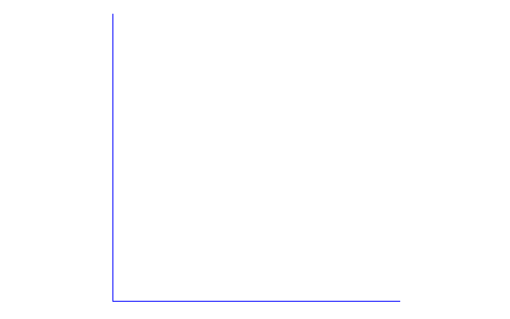

<!-- README.md is generated from README.Rmd. Please edit that file -->

# docxtools 

[](http://cran.r-project.org/package=docxtools)
[](https://cran.r-project.org/web/checks/check_results_rhub.html)
[](https://travis-ci.org/graphdr/docxtools)
[](https://CRAN.R-project.org/package=docxtools)
[](https://codecov.io/github/graphdr/docxtools?branch=master)
[](https://opensource.org/licenses/MIT)
[](https://cran.r-project.org/package=docxtools)

## Overview

docxtools is a small set of helper functions for using R Markdown to
create documents in docx format, especially documents for use in a
classroom or workshop setting. These are particularly useful when one
tries to do one’s own work reproducibly but has collaborators who work
with Office software exclusively.

  - `format_engr()` to apply engineering format to numbers
    <!-- - `align_pander()` to print a table of numbers using pander (deprecated) -->
  - `put_gap()` to create white space in a document
  - `put_axes()` to place unlabeled axes in a document

## Installation

From CRAN,

``` r
install.packages("docxtools")
```

Or you can obtain the most recent development version from GitHub.

``` r
install.packages("devtools")
devtools::install_github("graphdr/docxtools")
```

## Usage

The `density` data set is part of the package.

``` r
library(docxtools)
data("density")
density
#>         date trial    T_K   p_Pa   R  density
#> 1 2018-06-12     a 294.05 101100 287 1.197976
#> 2 2018-06-13     b 294.15 101000 287 1.196384
#> 3 2018-06-14     c 294.65 101100 287 1.195536
#> 4 2018-06-15     d 293.35 101000 287 1.199647
#> 5 2018-06-16     e 293.85 101100 287 1.198791
```

`format_engr()` applies engineering notation to numeric variables,
assigns significant digits, and adjusts for ambiguous trailing zeros.

``` r
y <- format_engr(density, sigdig = c(5, 4, 0, 4), ambig_0_adj = TRUE)
```

For printing the table, I suggest using `knitr::kable()`. (Note: The
table can be seen correctly rendered at the package
[website](https://graphdr.github.io/docxtools/).) docxtools \< 0.1.4
used the `align_pander()` function that is now deprecated and soon to be
defunct.

``` r
knitr::kable(y, align = "ccrrrr")
```

<table>

<thead>

<tr>

<th style="text-align:center;">

date

</th>

<th style="text-align:center;">

trial

</th>

<th style="text-align:right;">

T\_K

</th>

<th style="text-align:right;">

p\_Pa

</th>

<th style="text-align:right;">

R

</th>

<th style="text-align:right;">

density

</th>

</tr>

</thead>

<tbody>

<tr>

<td style="text-align:center;">

2018-06-12

</td>

<td style="text-align:center;">

a

</td>

<td style="text-align:right;">

\(294.05\)

</td>

<td style="text-align:right;">

\({101.1}\times 10^{3}\)

</td>

<td style="text-align:right;">

\(287\)

</td>

<td style="text-align:right;">

\(1.198\)

</td>

</tr>

<tr>

<td style="text-align:center;">

2018-06-13

</td>

<td style="text-align:center;">

b

</td>

<td style="text-align:right;">

\(294.15\)

</td>

<td style="text-align:right;">

\({101.0}\times 10^{3}\)

</td>

<td style="text-align:right;">

\(287\)

</td>

<td style="text-align:right;">

\(1.196\)

</td>

</tr>

<tr>

<td style="text-align:center;">

2018-06-14

</td>

<td style="text-align:center;">

c

</td>

<td style="text-align:right;">

\(294.65\)

</td>

<td style="text-align:right;">

\({101.1}\times 10^{3}\)

</td>

<td style="text-align:right;">

\(287\)

</td>

<td style="text-align:right;">

\(1.196\)

</td>

</tr>

<tr>

<td style="text-align:center;">

2018-06-15

</td>

<td style="text-align:center;">

d

</td>

<td style="text-align:right;">

\(293.35\)

</td>

<td style="text-align:right;">

\({101.0}\times 10^{3}\)

</td>

<td style="text-align:right;">

\(287\)

</td>

<td style="text-align:right;">

\(1.200\)

</td>

</tr>

<tr>

<td style="text-align:center;">

2018-06-16

</td>

<td style="text-align:center;">

e

</td>

<td style="text-align:right;">

\(293.85\)

</td>

<td style="text-align:right;">

\({101.1}\times 10^{3}\)

</td>

<td style="text-align:right;">

\(287\)

</td>

<td style="text-align:right;">

\(1.199\)

</td>

</tr>

</tbody>

</table>

Using `put_gap()` with knitr and R markdown, the gap height is specified
in the R code-chunk header.

<pre class="r"><code>```{r fig.height = 0.75}
# a gap with a border
put_gap(col = "gray", fill = NULL)
<code>```</code></code></pre>


For `put_axes()` with knitr and R markdown, the axis height is specified
in the R code-chunk header.

<pre class="r"><code>```{r fig.height = 2}
# first quadrant axes
put_axes(1, col = "blue", size = 0.5)
<code>```</code></code></pre>


